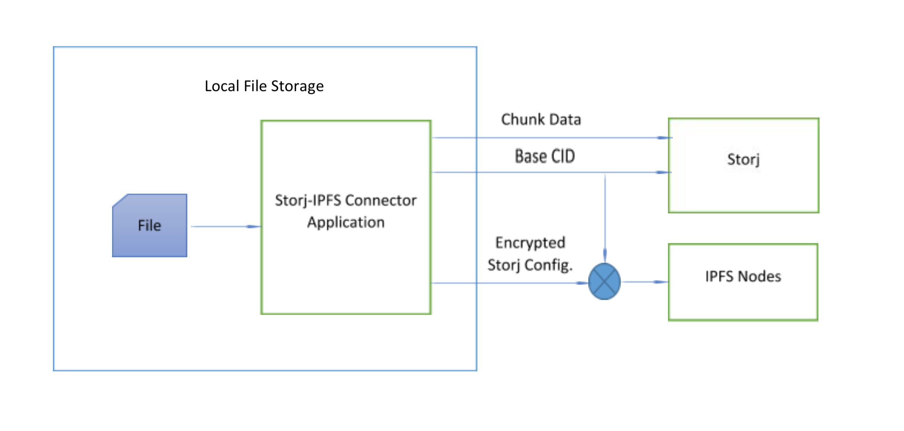
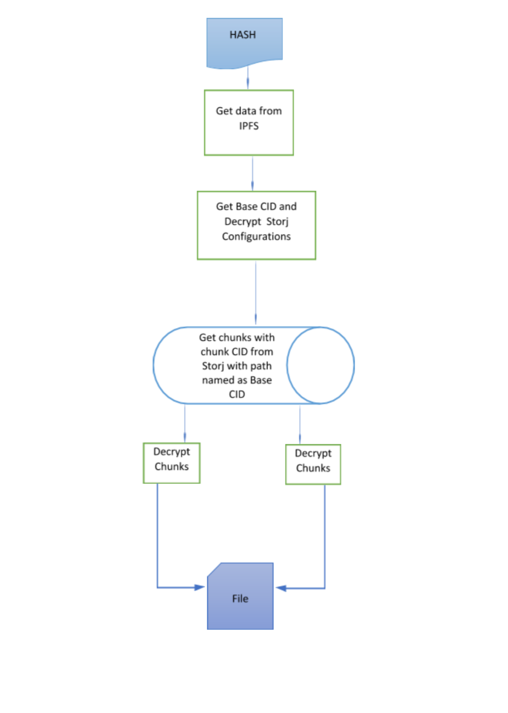


# storj-ipfs

Note: This project was done as a thought-experiment to explore novel uses of relatively flat distributed networks.  The goal of this effort was to combine features of the IPFS protocol with foundational features of the Storj protocol to evaluate the feasability to provide a global data plane with self-sustaining economic mechanics.


## upload flow


## download flow


## Install and configure- Go
* Install Go for your platform by following the instructions in given link
[Refer: Installing Go](https://golang.org/doc/install#install)

* Make sure your `PATH` includes the `$GOPATH/bin` directory, so that your commands can be easily used:
```
export PATH=$PATH:$GOPATH/bin
```

## Install and configure- IPFS
* Install IPFS on you system by downloading appropriate package from the following link: [Download IPFS for your platform](https://dist.ipfs.io/#go-ipfs)

* After installing IPFS on your system, before using IPFS for the first time, you’ll need to initialize the repository with the ipfs init command on `terminal`:

```
$ ipfs init
```

* Run the ipfs daemon in another `terminal` to join your node to the public network:

```
$ ipfs daemon
```

* After daemon has been started, you can check the state of your node by using your favorite web browser and opening:
```
http://localhost:5001/webui
```

For any help regarding above setup
[Refer: IPFS Documentation](https://docs.ipfs.io/introduction/usage/)

## Setting up Storj-IPFS project

* Put the storj-ipfs folder in ***`go/src`*** folder in your home directoy.

* Put the storj-ipfs-connector folder in ***`go/src`*** folder in your home directory.

* Now open `terminal`, navigate to the `storj-ipfs-connector` project folder and download following dependencies one by one required by the project:

```
$ go get -u github.com/urfave/cli
$ go get -u github.com/ipfs/go-ipfs-api
$ go get -u github.com/ipfs/go-ipfs-chunker
$ go get -u storj.io/storj/lib/uplink
$ go get -u ./...
```


## Set-up Files
* Create a `ipfs_upload.json` file, with following contents about IPFS instance:
    * hostName :- IPFS Host Name to create Node and connect
    * port :- IPFS Port to create Node and connect
    * path :- Path of file along with file name and extention on local storage to upload.
    * chunkSize :- Split file into given size before uploading.

```json
    { 
        "hostName"  : "ipfsHostName",
        "port"      : "5001",
        "path"      : "localFilePath/fileName.fileExtention",
        "chunkSize" : "chunkSizeToSplitData"
    }
```

* Create a `storj_config.json` file, with Storj network's configuration information in JSON format:
    * apiKey :- API key created in Storj satellite gui
    * satelliteURL :- Storj Satellite URL
    * encryptionPassphrase :- Storj Encryption Passphrase.
    * bucketName :- Split file into given size before uploading.
    * uploadPath :- Path on Storj Bucket to store data (optional) or "/"
    * serializedScope:- Serialized Scope Key shared while uploading data used to access bucket without API key
    * key :- Secret key used to encrypt Storj config data (should be of 32 letters)
    * disallowReads:- Set true to create serialized scope key with restricted read access
    * disallowWrites:- Set true to create serialized scope key with restricted write access
    * disallowDeletes:- Set true to create serialized scope key with restricted delete access


```json
    { 
        "apiKey"        : "change-me-to-the-api-key-created-in-satellite-gui",
        "satelliteURL"  : "us-central-1.tardigrade.io:7777",
        "encryptionPassphrase"  : "you'll never guess this",
        "bucketName"    : "change-me-to-desired-bucket-name",
        "uploadPath"    : "optionalpath/",
        "serializedScope" :"change-me-to-the-api-key-created-in-encryption-access-apiKey",
        "key"           : "secret-key-to-protect-Storj-data-of-32-letters",
        "disallowReads": "true/false-to-disallow-reads",
        "disallowWrites": "true/false-to-disallow-writes",
        "disallowDeletes": "true/false-to-disallow-deletes"
    }
```
    
* Create a `ipfs_download.json` file, with following contents about IPFS instance:
    * hostName :- IPFS Host Name to create Node and connect
    * port :- IPFS Port to create Node and connect
    * shareableHash :- Shared file Hash to download.
    * downloadPath :- Path on local storage to download data.
    * apiKey :- API key created in Storj satellite gui
    * satelliteURL :- Storj Satellite URL
    * encryptionPassphrase :- Encryption Passphrase of Storj from which data is to be downloaded
    * serializedScope :- Serialized Scope Key shared while uploading data used to access bucket without API key
    * key :- Secret key used to decrypt Storj config data (should be of 32 letters)
```json
    { 
        "hostName"      : "ipfsHostName",
        "port"          : "5001",
        "shareableHash" : "hash (from ipfs) of file to download",
        "downloadPath"  : "localFilePath",
        "apiKey"    : "change-me-to-the-api-key-created-in-satellite-gui",
        "satelliteURL"  : "us-central-1.tardigrade.io:7777",
        "encryptionPassphrase": "you'll never guess this",
        "serializedScope" :"change-me-to-the-api-key-created-in-encryption-access-apiKey",
        "key"           : "uploadedFileSecretKeyFromUser"
    }
```

* Store these files in a `config` folder.  Filename command-line arguments are optional.  Default locations are used.

## Build ONCE
In `terminal`, go to your storj-ipfs project folder and create executable by running:
```
$ go build
```


## Run the command-line tool
    storj-ipfs-connector.exe [global options] command [command options] [arguments...]
**NOTE**: Make sure `ipfs deamon` is already running on seperate `terminal` before using these commands. The following commands operate in a Windows platform system:

* Get help
```
    $ storj-ipfs-connector.exe -h
```

* Check version
```
    $ storj-ipfs-connector.exe -v
```

* Read file data from desired IPFS instance and upload it to given Storj network bucket using Serialized Scope Key.
    * **NOTE**: Filename arguments are optional.  Default locations are used.
```
    $ storj-ipfs-connector.exe store ./config/ipfs_upload.json ./config/storj_config.json  
```
* Read file data from desired IPFS instance and upload it to given Storj network bucket using API key and EncryptionPassPhrase from storj_config.json and creates an unrestricted shareable Serialized Scope Key.  
    * **NOTE**: Filename arguments are optional.  Default locations are used.
```
    $ storj-ipfs-connector.exe store ./config/ipfs_upload.json ./config/storj_config.json key
```

* Read file data from desired IPFS instance and upload it to given Storj network bucket using API key and EncryptionPassPhrase from storj_config.json and creates a restricted shareable Serialized Scope Key.  
    * **NOTE**: Filename arguments are optional.  Default locations are used. `restrict` can only be used with `key`.
```
    $ storj-ipfs-connector.exe store ./config/ipfs_upload.json ./config/storj_config.json key restrict
```

* Read file data in `debug` mode from desired IPFS instance and upload it to given Storj network bucket.
    * **NOTE**: Filename arguments are optional.  Default locations are used. Make sure `debug` folder already exist in project folder.
```
    $ storj-ipfs-connector.exe store debug ./config/ipfs_upload.json ./config/storj_config.json  
```


* Read and parse Storj network's configuration, in JSON format, from a desired file and upload a sample object
```
    $ storj-ipfs-connector.exe test 
```

* Read and parse Storj network's configuration, in JSON format, from a desired file and upload a sample object in debug mode.
    * **NOTE**: Default locations are used. Make sure `debug` folder already exist in project folder.
```
    $ storj-ipfs-connector.exe test debug 
```

* Read and parse IPFS network's configuration, storj Serialized Scope Key and file hash, in JSON format, from a desired file and download file on local system in desired location.
    * **NOTE**: Make sure the download folder given in `ipfs_download.json` already exist, if it doesn't, downloaded data will not be saved. `serializedScope` will be used to access storj data.
```
    $ storj-ipfs-connector.exe download ./config/ipfs_download.json 
```

* Read and parse IPFS network's configuration, storj API Key, Satellite, EncryptionPassPharse and file hash in JSON format, from a desired file and download file on local system in desired location.
    * **NOTE**: Make sure the download folder given in `ipfs_download.json` already exist, if it doesn't, downloaded data will not be saved. `apiKey` will be used to access storj data.
```
    $ storj-ipfs-connector.exe download ./config/ipfs_download.json key
```

* Read and parse IPFS network's configuration and file hash, in JSON format, from a desired file and download file in `debug` mode on local system in desired location.
    * **NOTE**: Make sure the download folder given in `ipfs_download.json` already exist, if it doesn't, downloaded data will not be saved.
```
    $ storj-ipfs-connector.exe download debug ./config/ipfs_download.json 
```
